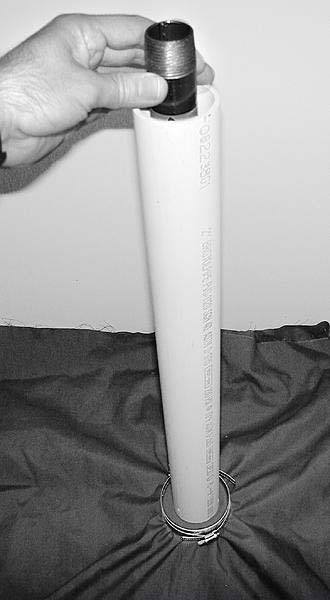
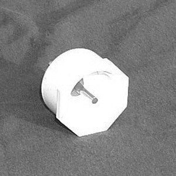
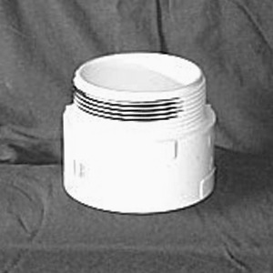
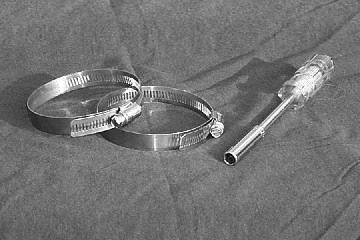
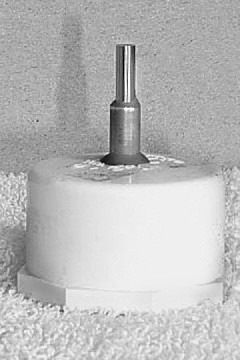
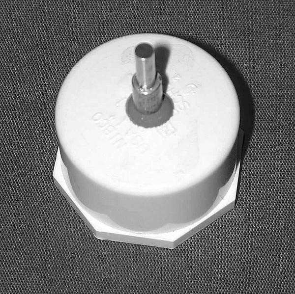
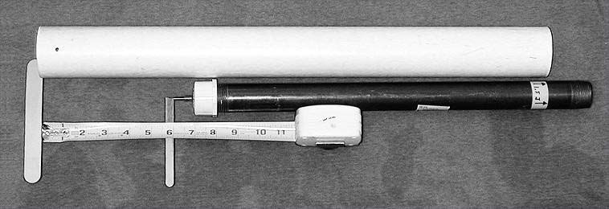

# Rapier Marshal’s Handbook - October 2013 Edition
 
Copyright 2013 - The Society for Creative Anachronism, Inc. All Rights Reserved.

This handbook is an official corporate publication of the Society for Creative Anachronism, Inc., a nonprofit organization dedicated to researching and recreating the customs, combat, and courtesy of the Middle Ages and the Renaissance. Copies of this document can be ordered from SCA Marketplace, PO Box 360789, Milpitas, CA 95036-0789.

Members of the Society for Creative Anachronism, Inc. may photocopy this work in whole or in part for SCA use provided copyright credit is given and no changes are made to the text. The contents of this document will be posted at http://www.sca.org and further reproduction on other internet sites is expressly forbidden.

## INTRODUCTION
These rules set fundamental standards for rapier combat in the SCA. 
They are designed to allow use by the Kingdoms of the Society as basic rules, to which Kingdom-specific preferences (such as the weapons used) can be added. 
In keeping with Corpora, Kingdoms retain the right to add rules which establish more restrictive standards. 
All fighters and marshals are responsible for knowing these rules, as well as the additional rules of their Kingdom.  

Rules are designed to promote safe rapier combat in the Society. However, no matter how clear or accurate, rules cannot replace common sense, good judgment, and concern for the participants. 
If a question arises when applying these standards, choose the answer that promotes the greatest degree of safety for all participants.

### CONVENTIONS
#### GENERAL INFORMATION

1. Rapier Combat shall be conducted in accordance with the Rules of the Lists of the SCA, Inc., these rules, and such further rules as are established by the Kingdoms.
2. All combatants, prior to every combat or practice, shall ensure their equipment is safe, in good working order and has been inspected by a member of the Kingdom Marshallate authorized to inspect rapier gear.
3. At interkingdom events, for any given Kingdom's tourney, guest combatants shall meet SCA standards for protective gear, but shall comply with whatever weapons standards are being used by the host kingdom for that tourney.
4. Unless otherwise directed by Kingdom Law, the Crown's representative upon the field and in all matters dealing with Rapier Combat is the Earl Marshal, then the Kingdom Rapier Marshal, then, by delegation, members of the Kingdom Rapier Marshallate.
5. There are three categories of rapier combat, each requiring separate authorization. Each Kingdom can decide which categories of rapier combat they will permit in their rules. These categories are:

    * light rapier
    * heavy rapier
    * cut and thrust rapier

    Except where noted, all rules apply to all three forms of rapier combat. One of the major differences in the three forms is the allowable blades, which are specified later in this document.

#### BEHAVIOR ON THE FIELD
1. All fighters shall obey the commands of the marshals overseeing the field, or be removed from the field and subject to further disciplinary action.
2. Disagreements with the marshals overseeing the field shall be resolved through the established mechanisms outlined in the Marshallate Procedures of the SCA, Inc.
3. Each fighter shall maintain control over his or her temper and behavior at all times.
4. Striking an opponent with excessive force, or with deliberate intent to injure, is forbidden.
5. Upon hearing the call of "HOLD" all fighting shall immediately stop. The fighters shall freeze, check for hazards in their immediate vicinity, and then assume a non-threatening position with their weapons pointed away from their opponents.
6. Conduct obstructive of normal rapier combat, such as consistent ignoring of blows, deliberate misuse of the rules (such as calling HOLD whenever pressed), or the like, is forbidden.

#### USE OF WEAPONS AND PARRYING DEVICES
1. Valid blows are struck by: thrusting with the point of the blade (thrust) or sliding the edge of the blade by drawing (draw cut).
    1. Kingdoms have the option of including sliding the edge of the blade by pushing (push cut) and/or placing the tip of the blade upon and then drawing it across an opponent (tip cut) as valid blows.
    2. Cut and thrust rapier also includes the use of percussive cuts as a valid blow.  Percussive cuts must always be delivered with sufficient control so as not to injure the opponent while still delivering the necessary impact for a valid cut.
2. Chopping or hacking blows are not permitted in light or heavy rapier combat. For cut and thrust rapier, they still must be delivered with sufficient control. Fast circular movements (such as moulinets) may be used to place a blade for allowable cuts in all three categories of rapier combat.
3. Parrying devices may be used to move, deflect, or immobilize an opponent's weapon or parrying device, so long as such use does not endanger the safety of the combatants.
4. Striking an opponent with any part of a weapon or parrying device not approved for that purpose is prohibited.

#### ACKNOWLEDGEMENT OF BLOWS
1. In judging blows, all fighters are presumed to be wearing common civil attire of the period, not armor.
2. Tourneys may be held which define areas of the body as if armored, and to what degree, so long as all the participants are made aware of these special conditions prior to the start of combat.
3. In rapier combat, blows will be counted as though they were struck with a real blade, extremely sharp on point and edge. Any blow that would have penetrated the skin shall be counted a good blow. Any blow that strikes a mask, helm or gorget shall be counted as though it struck flesh. Kingdoms shall not alter this standard. 
4. A valid blow to the:

    * head,
    * neck,
    * torso,
    * inner groin (to the fighter's hand width down the inner limb), or
    * armpit (to the fighter's inner hand width down the limb)

    shall be judged incapacitating, rendering the fighter incapable of further combat.

5. A valid blow to the arm will disable the arm. A valid blow to the hand shall render the hand useless; Kingdoms may decide whether the arm above the incapacitated hand may be used to parry.
6. A valid blow to the foot or leg will disable the leg.

    1. For light rapier and heavy rapier, the fighter must then fight kneeling, sitting, or standing on one leg.
    2. For cut and thrust rapier, valid blows to the leg or foot are considered incapacitating, rendering the fighter incapable of further combat.
7. Parries may be performed with weapons, parrying devices, the gloved hand or any other part of the body. Though the gloved hand may be used to parry, it shall not be used to grasp or strike an opponent. Fleeting contact between opponents is allowed, as long as no grappling, deliberate striking or other unsafe behavior occurs.
8. In heavy rapier and cut and thrust rapier, fighters may choose to grasp blades, rather than parry them. If the blade that is grasped moves or twists in the grasping hand, that hand is deemed disabled. Grasping techniques shall be used only to immobilize a blade, not to bend it or wrest it from the opponent's grip. Prolonged wrestling over a grasped blade is sufficient grounds for calling a ‘hold” and forcing a release of the blade.
9.  If an effective blow is thrown before, or on, the same moment as an event that would stop a fight (a "HOLD" being called, the fighter being "killed" himself, etc.), the blow shall count. If the blow is thrown after the hold, killing blow, or other event, it shall not count.

### WEAPONS AND PARRYING DEVICES
1. GENERAL
    1. Sharp points, edges or corners are not allowed anywhere on any equipment.
    2. All equipment must be able to safely withstand combat stresses.
    3. Equipment that is likely to break a blade or damage other equipment is prohibited.
         1.  Light rapier does not permit any equipment that has small rigid openings large enough to admit a properly tipped light rapier blade (i.e. small holes in bell guards, small openings in a cage or swept hilt, any design which has acute angles where a blade could easily be wedged and bent). Knuckle bows are deemed safe for use with light rapier blades.
2. BLADES
    1.  If a blade meets the criteria below, it is considered acceptable for use unless specifically restricted from use by the Deputy Society Marshal for Rapier Combat. If a blade does not meet the criteria established below, it may not be used for any form of rapier combat in the Society, unless it is permitted by the Deputy Society Marshal for Rapier Combat.  Exceptions (permitted blades or restricted blades) will be maintained in [Appendix - "Exceptions to Allowed Blades Rules"](#exceptions-to-allowed-blades-rules).
    2. All blades are subject to the following:
        1. Blades must be made of steel
        2. Blades must be no longer than 48" as measured from the tip to the top of the tang (i.e. where the tang and forte meet)
        3.  Blades must be reasonably flexible as defined in [Appendix - "Blade Flexibility Testing"](#blade-flexibility-testing).
        4.  Light rapier blades longer than 18” must be a foil blade, epee blade, or similar variant (such as a double-wide epee or musketeer blades) from an established commercial manufacturer. Light rapier blades 18” or shorter need only meet the requirements previously listed.
        5.  Blades with a cross-section similar to a foil or epee (ie., foils, epees, double-wide epees, musketeers and flexi-daggers) are not allowed in Heavy Rapier, nor Cut & Thrust combat.
        6.  Steel blades will not be altered by grinding, cutting, heating, hammering, or other actions that could significantly alter their temper, flexibility or durability. Normal combat stresses and blade care do not violate this rule. Exceptions are:
            1. The tang of the weapon may be altered.
            2. Heavy rapier and cut and thrust rapier blades may be shortened so long as they maintain acceptable flexibility.
            3.  A nut or other blunt metal object designed to spread impact may be welded to the tip of heavy rapier and cut and thrust rapier blades so long as care is taken to prevent damage to the temper of the blade. The blunt object will still need some form of coverage, per 2.B.ix. below.
        7.  Rigid steel "parrying-only" daggers such as those made from cut down blades will not be allowed.
        8.  All blade ends must be capped with rubber, plastic, or leather.
            1. Tips will have a blunt striking surface, presenting a cross-section of at least 3/8 inch (9 mm) diameter.
            2. Tips must be firmly taped or glued in place. The tip must be of a color contrasting with the blade so that the tip's absence is readily apparent. If tape is used, it must contrast with both blade and tip.
        9.  Any blade with kinks, sharp bends, or cracks shall not be used. Steel blades that develop these defects cannot be repaired and must be retired. Light rapier blades or flexidaggers with "S" curves shall not be used unless they can be properly re-curved.
        10.  Weapons may use a hand guard such as a cup hilt, swept hilt or quillons and knuckle bow. The ends of quillons must be blunt.
        11.  Orthopedic (or "Pistol") grips will not be used unless the fighter has approval for medical reasons, supported by documentation from their health care provider.

3. PARRYING DEVICES:
    1. Solid parrying devices will be made of sturdy, lightweight materials, resistant to breakage and splintering.
    2. Soft, non-rigid devices such as cloaks may be made of cloth, foam, leather and similar materials. They may be weighted with soft material such as rope or rolled cloth; they shall not be weighted with any rigid material nor with materials which are heavy enough to turn the device into a flail or impact weapon.
    3. Devices that predictably cause entangling of an opponent or their equipment, either by design or by repeated mishap, are not allowed.
    4. Offensive bucklers will be considered non-standard devices. These devices must be approved on a case by case basis, in accordance with rules established by each kingdom's Rapier Marshallate. An opponent may decline to face non-standard devices without forfeiting a bout. Offensive bucklers shall be made of soft flexible materials such as cloth, tape, foam and golf tubes.

4. PROJECTILE WEAPONS
    1. Kingdoms may permit combat archery, throwing weapons, and/or mock-gunnery gear (such as rubber-band guns) to be used in rapier melee combat, as long as safety standards for those arts are met.
    2. The use of any projectile weapon is forbidden within formal rapier Tournament lists (single combat), or in any situation where spectators cannot be separated from the potential line of fire by more than the effective range of the projectile weapons to be used.

## PROTECTIVE GEAR
1. TERMS
    1. Materials are listed in order of increasing resistance.
    2. Abrasion-resistant material: material that will withstand normal combat stresses (such as being snagged by an unbroken blade) without tearing. Examples include, but are not limited to:
        * broadcloth
        * a single layer of heavy poplin cloth (35% cotton, 65% polyester; "trigger" cloth)
        * sweat pants
        * opaque cotton, poly-cotton or lycra/spandex mix tights

         Nylon pantyhose and cotton gauze shirts are examples of unacceptable materials.

    3. Puncture-resistant material: any fabric or combination of fabrics that will predictably withstand puncture. Examples include, but are not limited to:
        * four-ounce (1.60 mm) leather
        * four layers of heavy poplin cloth
        * ballistic nylon rated to at least 550 Newtons
        * commercial fencing clothing rated to at least 550 Newtons

        Kevlar is not an acceptable material, as it degrades rapidly. These materials need only be tested at the marshal’s discretion; all other materials must be tested the first time new gear is used, or if no marshal on the field knows a given piece of gear to have been tested.  (Refer to Appendix 1 on Testing Standards.)
    4. Rigid Material: puncture-resistant material that will not significantly flex, spread apart, or deform under pressure of 12 Kg applied by a standard mask tester, repeatedly to any single point. Examples of rigid material are:
 
        * 22 gauge stainless steel (0.8 mm)
        * 20 gauge mild steel (1.0 mm)
        * 16 gauge aluminum, copper, or brass (1.6 mm)
        * one layer of hardened heavy leather (8 ounce, 3.18 mm)

2. ARMOR REQUIREMENTS
    1. The following are the Society norms for protective gear. Kingdoms enacting more stringent standards shall weigh the benefits of more rigorous penetration coverage against the risks of heat illness, exhaustion, and stroke due to heavier or more confining gear.
    2. HEAD AND NECK
        1. The front and top of the head must be covered by rigid material to below the jaw line and behind the ears. Standard 12 kg fencing masks are known to meet this standard. If built to this standard, fencing helms are also acceptable.
        2.  The face must be covered by either 12 kilogram mesh (e.g, a standard fencing mask) or perforated metal. Such metal must not have holes larger than 1/8" (3 mm) in diameter, with a minimum offset of 3/16" (5 mm) and shall also meet the definition of rigid material.
        3.  Masks and helms must be secured to the fighter, so that they cannot be easily removed or dislodged during combat. The combination of snug fit and the spring-tongue in a conventional fencing mask is NOT sufficient, by itself, to secure the mask to the fighter.
        4.  Both modern fencing masks and rapier helms, when inspected, shall comply with the rigid material standard, provisions on facial coverage, and shall show no evidence of impending failure (e.g., rust which weakens the metal involved, dents or other defects which spread open mesh, broken weld points, etc). If there is concern about the face mesh of a modern fencing mask, it should be tested using a standard commercial 12kg mask punch. Marshals doing the testing shall be trained in the use of the punch. The Kingdom Rapier Marshals may elect to designate certain deputies to administer such testing.
        5.  The rest of the head and neck must be covered by at least puncture resistant material.
        6.  For heavy rapier and cut and thrust rapier, additional throat protection is required; it shall consist of rigid material, as noted above, covering the entire throat, and shall be backed by either puncture resistant material (as a hood), one quarter inch (1/4") (6 mm) of open-cell foam, or their equivalents. The cervical vertebrae shall also be protected by rigid material, provided by some combination of gorget, helm, and/or hood insert.
        7.  For cut and thrust rapier, the back of the head must also be covered by rigid material, as noted above sufficient to protect against percussive cuts.
    3. TORSO AND OTHER KILLING ZONES
        1.  The entire torso (the chest, back, abdomen, groin, and sides up to and including the armpits) must be covered with puncture-resistant material.
        2.  Acceptable minimum armpit coverage is provided by a triangle extending from the armpit seam, covering the lower half of the sleeve at the seam, and extending down the inner/under arm, one-third the distance to the fighter's elbow.
        3.  Male fighters shall wear rigid groin protection. Any ventilation holes large enough to admit a broken blade must be covered from the outside with at least puncture-resistant material. Female fighters shall wear puncture resistant groin protection.
    3. ARMS AND LEGS
        1.  Hands shall be protected by gloves, made of abrasion resistant material, that overlap any sleeve openings as below. Feet shall be protected by boots, shoes, or sandals, comprised of at least abrasion-resistant material.
        2.  Abrasion-resistant material is required on arms (save as noted above for armpits), legs, and any area not otherwise mentioned in these rules.
        3.  No skin shall be bared. There shall be sufficient overlap between separate pieces of protective clothing, regardless of the fighter's stance or movements, that the minimum protection for that body area be preserved.
        4.  For cut and thrust rapier, elbows must be further protected by a minimum of an athletic pad or equivalent materials.

## MARSHALLING CONCERNS IN RAPIER COMBAT
1. AUTHORIZATIONS: Competence in other SCA combat styles does not automatically mean competence in rapier. Separate warrants and authorizations in rapier combat are required.  Each Kingdom can decide how they wish to control authorizations for each category of rapier combat.
2. BROKEN BLADES: Marshals and fighters shall pay special attention for missing tips or broken blades.
3. CLOAKS: When cloaks are used, "HOLD" should be called if the cloak becomes tangled about either fighter, or about one of the weapons such that the weapon cannot be withdrawn.  "HOLD" need not be called if the cloak is merely near the face, deflecting a weapon (assuming that the Kingdom rules allow use of the cloak for blocking or deflection), loosely draped over, or weighting down the blade.
4. BLADE GRASPING: Blade grasping is allowed in heavy rapier and cut and thrust rapier.  When a blade has been grasped by an opponent, "HOLD" shall be called if wrestling about the blade occurs.
5. EXCESSIVE IMPACT: Combat in the Society poses risks to the participant. This recognition, however, does not excuse fighters from exercising control of their techniques. If a fighter throws blows which force their opponent to retire from the field, from a real injury (even one which only causes brief incapacitation), the marshal responsible for the field shall take such steps as are appropriate to stop the problem from recurring.
6. MELEE: Melee combats present special challenges to all involved. Society norms are as below:
    1. In melees, fighters are engaged with all opponents immediately upon the call to lay on.
    2. Fighters may strike any opponent with any legal blow if they are within the 180 degree arc of the opponent's front. A fighter who approaches an opponent from behind shall not deliver a blow until he is within that frontal arc. A fighter may never deliberately strike an opponent from behind.
    3. Killing from behind is allowed if it has been announced beforehand. The Society norm for "death from behind" in melees shall be: If a melee scenario allows killing from behind, a fighter does so by laying the rapier blade over the opponent's shoulder, to at least a third of the blade, while calling "Dead, my lord" (or other short, courteous phrases) in a loud, clear voice. Reaching around the neck is forbidden. The opponent will be deemed "killed" from the instant the blade touches his shoulder and shall not attempt to spin, duck or dodge away.
        1. If death from behind is not allowed in a given melee, a fighter who deliberately ignores an attacker behind them, or repeatedly maneuvers to keep their back to an attacker (thereby preventing any attack on them) may be considered for misuse of the rules and obstructive behavior.
        2.  Daggers may also be used but care must be taken not to punch or strike the fighter with the guard or quillions of the dagger when so used.
    4. In special scenario melees (e.g., bridge or town battles), additional restrictions may be imposed by the marshals as needed.
    5. Cut and thrust rapiers may not be used in melees.
7. MINORS: The minimum age for training and authorization in rapier combat is 14. When fighters under the age of 18 undertake training and authorization, the Kingdom Rapier Marshal (or his designated representatives) shall ensure that the minor's parent or legal guardian has observed rapier combat, is aware of the risk of injury inherent in this martial art, and has signed a statement explicitly acknowledging the above.
    1. A youth rapier fighter may participate in melees with other rapier fighters (youth and/or adult) subject to whatever age requirements and other qualifications that are mandated by their kingdom rules.
8. PERIODIC TESTING OF PROTECTIVE GEAR: Kingdoms shall require all gear to have been formally tested (including fabric and mask tests, as appropriate) at least once every two years. Compliance is the responsibility of the individual fighter. Any protective gear may be formally tested if there is concern that the gear may have lost protective ability due to age, wear and tear, or other factors. Refer to Appendix 1 on Testing Standards.
9. UNFORESEEN SITUATIONS: Should a situation arise not explicitly covered by Corporate or Kingdom rapier combat rules, the marshals should NOT assume that the situation is forbidden or inappropriate. Again: However, no matter how clear or accurate, rules cannot replace common sense, good judgment, and concern for the participants.
 
## APPENDIX
### TESTING STANDARDS FOR SCA RAPIER COMBAT
#### FABRIC TESTING FOR PROTECTIVE GEAR
1.  Tests known to be acceptable include:
    1. Cloth or garment manufacturer's commercial certification that a fabric is rated to 550N.  (Documentation must be available at the time of inspection.)
    2. Use of 550N garment punch test devices, manufactured by sources acceptable to the Deputy Society Marshal for Rapier Combat. Such a device shall be used in accordance with its' instructions.
    3.  Use of a drop test device which delivers a force, on dropping, of 1.5 joules to the fabric sample via a dull, flat 5/32" (4 mm) metal rod. As a general example, this rod can be mounted on a 1.0 kg (2.2 lbs) solid weight and dropped down a guide tube from 15.3 cm (6 inches) onto the fabric sample. The sample must be held firmly over a 3" diameter externally threaded frame by clamps when the drop test is applied. More specifically, the drop tester must be constructed and used as described in instructions found in Appendix 3 of these rules.
4. Use of a flat-broken foil blade to thrust against the material. To conduct this test, lay the material to be tested on firm ground or penetrable material (not hard packed dirt, concrete or similarly hard surfaces). Holding the broken blade in both hands, punch the material four times, increasing the force each time. After each punch, examine the material. For these tests, if the material in question has been completely penetrated, or penetrated in more than one layer, it fails. If only the top layer has been damaged, then it passes.

#### BLADE FLEXIBILITY TESTING
The definition of “reasonably flexible” is dependent upon the length of the blade and the weapon class it is to be used in. To determine if a weapon meets the standard of being "reasonably flexible": Hold the weapon parallel to the ground, supporting the handle against a table or bench if necessary. Hang a 6 ounce weight (170 grams) -one inch (25mm) or less from the end of the tip. If the blade flexes as indicated in the following table then it is deemed “reasonably flexible” for that weapon class.
    
| Weapon Class | Blade Length | Minimum Deflection | Weight |
| ------------ | ------------ | ------------------ | ------ |
| Light Rapier, Heavy Rapier | \> 18” (45.72 cm) and \<= 48” (121.92 cm) | 1” (25 mm) | 6 oz (170 grams) |
| Light Rapier, Heavy Rapier | \<= 18” (45.72 cm) | 1/2" (12 mm) | 6 oz (170 grams) |
| Cut & Thrust | \<= 48” (121.92 cm) | 1/2" (12 mm) | 6 oz (170 grams) |

### PROCEDURES FOR EXPERIMENTATION IN RAPIER COMBAT
Before any new weapon or technique can be used in Society Rapier Combat, a test plan must be submitted to and approved by the Deputy Society Marshal for Rapier Combat. This plan shall describe:

* The new weapon or technique
* Specifics of materials used and construction of the weapon (as appropriate);
* In the case of new blade types, a sample of the new blade-type for direct evaluation by the Deputy Society Marshal
* The proposed uses of the new weapon or technique
* All restrictions that will be imposed during the experimental period
* How long the test period will be

It is the prerogative of the Kingdom Rapier Marshals, subject to the above, and to approval of their Earl Marshals, to allow testing of new weapons or techniques within a kingdom.  Testing means the weapon or technique may be used at fighter practice, tourneys, and in small melees after all combatants and marshals have been informed the weapon or technique is being tested and that it is not approved for general SCA use. All combatants and marshals must consent to the use of the weapon or technique before combat begins. If any of the marshals or combatants object to the use of the weapon or technique, it may not be used.

At regular intervals the Kingdom Rapier Marshal shall report to their Earl Marshal, and the Deputy Society Marshal, on the progress and results of the experiment. At the end of the test period the Kingdom Rapier Marshal will provide the Deputy Society Marshal with a test summary, to include a list of any injuries that resulted from the use of the weapon or technique, and any concerns from fighters and marshals arising from the testing. The Deputy Society Marshal, after consultation with the Kingdom Rapier Marshals, shall determine if the weapon or technique seems suitable for SCA Rapier Combat. He shall then report to the Society Marshal for final adjudication.

### PROCEDURES FOR CREATION OF A DROP TESTER

It is important not to deviate from the construction specifications given below without approval, as seemingly minor changes can affect the test results.  There are three major parts to the tester, the drop probe (the weighted piece), the guide tube, and the round frame (3" flange, below) over which the fabric to be tested is clamped. The actual test method is detailed in Appendix 4 of the Society Rapier Combat Rules but here is a brief overview:

Clamp the fabric over the 3" flange, balance the guide tube over the center of the fabric, and drop the weighted drop probe down the middle of the guide tube, as shown in [Figure 1](#figure-1), below. If the rod on the end of the falling drop probe punches through, the fabric fails, if it doesn't punch through the fabric passes.
 
These instructions describe how to build a drop tester for carrying out these tests. It won't take very long to build, and will not be very expensive, but does need one special part.

#### Parts list
* 1" nominal diameter 18" long Black Pipe stub from any do-it-yourself/hardware store, plumbing supply house, etc, this is heavy, iron pipe used for natural gas.
* 1" nominal plastic cap for pipe above (screws onto end of pipe)
* 0.156" (5/32") "plus tolerance" diameter gage pin, 2 inch length, such as from Meyer Gage Company, CT, 860-528-6527, Class ZZ, $2 each, $10 minimum order (http://www.meyergage.com/products/english_gage_sets.htm)

    NOTE: As of 2006, Meyer replaced their Class ZZ gauge pin with a Class Z gauge pin. This pin is also acceptable for use.

* drill bit stop or collar (piece that goes on to a drill bit to set the depth of a hole)
* epoxy (the solid grey type such as JB Weld works well, clear epoxies do not hold up as well)
* 2" nominal diameter PVC or equivalent (material doesn't matter for this), at least 30"
* 3" PVC 3" Male Adp. DWV (short section of PVC, has \*external\* threads on one end)
* 2 hose clamps, 2.5" to 4" range (large enough to fit over 3" adapter above)
* screwdriver or nut driver (to operate test)

#### Construction Tools
* Power drill with 5/32" drill bit
* scale capable of measuring to about ½ oz or 10 g (can go to post office and use theirs)
* (optional) saw (some way to cut the PVC pipe above, or can have it done at hardware store)
* (optional) file, sandpaper, to smooth PVC

#### Construction
1. Make the Guide Tube
    1. Cut the 2" nominal diameter PVC tube to 23.6" (60 cm) in length. Try to make the ends square (so when it is placed on a flat surface on either end, it stands up straight). A wood saw is fastest for this, a hack saw will work as well, or get it cut at the store you buy it at.
    2. Drill three holes with the 5/32" drill bit near the bottom end of it for air release when the probe drops, the location doesn't matter as long as they are within a couple of inches of the bottom.
2. Make the Drop probe
    1. First get a gage pin, at the supplier above. Do not modify the end, these pins are used because they are consistently manufactured. Make sure that the pin is clean of any oil or other chemicals that would keep the glue from sticking properly.
    2. Drill a hole in the center of the 1" plastic cap with the 5/32" drill bit.
    3. Now put the drill collar on the gage pin with about half of the gage pin sticking out of one side, and apply epoxy. Before it dries, put more epoxy on the gage pin, and shove it into the hole in the cap, with the drill collar on the outside, curved side of the cap. The exact type of drill collar isn't important, it is just to provide some extra grip to keep the gage pin from breaking loose and sliding up into the drop probe with repeated impacts, since the PVC hole alone isn't a great glue surface.
    4. When you have it put together and the epoxy is still wet, put it on a flat surface and slide the gage pin down until it bottoms out where the plastic cap sits on the flat surface. It will look something like [Figure 2](#figure-2), below, when done. Make sure the gage pin doesn't dry at an angle (it should be parallel to the iron pipe, keep checking visually as it dries). If the pin isn't sticking straight out of the cap, your drop tester will not work properly.  
    5. After the epoxy dries, screw the cap on to one end of the pipe (make sure not to get epoxy on the threads, you may want to remove it later!).
    6. Weigh the drop probe assembly, using a good scale. It should be able to measure to half an ounce or 10 grams, a postal scale at the post office could work for example. If possible, try to use metric units - it will make calculations easier later on.
    7. The height from which the probe will be dropped is directly dependent on the weight of the probe. Since not all cast iron pipe will weight the exact same amount, and the length of the pipe may be off by a small portion, calculate the exact drop height for the probe being constructed. Use the formula below for a 1.5 Joule drop energy to calculate the drop height for your tester.
        In Metric units: 15306 / (the probe weight in grams) = drop distance (in cm)

        In American units:  212.6 / (the probe weight in ounces) = drop distance (in inches)
    
        Plug the measured drop probe weight into one of the formulas and calculate the drop distance. It should be between 10 and 20 cm (4 and 8 inches), if not, you found a really unusual pipe stub and should not proceed further.
    8. Lay the probe next to the PVC tube from the first step, slide it "up" next to the PVC guide tube until you have that calculated drop distance from the bottom of the PVC tube to the gage pin sticking out of the drop probe, and mark the top end of the drop probe where it lies next to the top of the PVC guide tube (tape, etc.). That is the mark you will want to line up with the top of the PVC tube when you drop the probe. Some of the probe will stick out of the top end of the tube when you have it all together vertically and give you a place to grab it. (The reason metric units are easier is that it's easier to measure fractions of a centimeter than it is fractions of an inch.)

3. The Clamps and Frame

    No modifications needed here, you just need the two hose clamps and the threaded flange, along with a screwdriver or nut driver to tighten the hose clamps. Do not substitute other parts for the flange with outside threads, as the grip on this surface has a big impact on fabric slippage, which has a big impact on whether the test passes or fails armor.

    It is suggested that you get a nut driver (like a screw driver, but with a socket head) for tightening and loosening these hose clamps, it is much easier to use than a screw driver as well as being safer.

### PROCEDURES FOR USE OF A DROP TESTER
The basic idea behind this test is to drop a known weight a known distance to give a known impact, giving a pass/fail verdict to "unknown" fencing armor. This document will tell you how to use the tester to test armor. See Appendix 3/Building a Drop tester for how to choose and build these items. You should have all six pieces shown in [Figure 5](#figure-5), below, including a guide tube, drop probe (unique to your tester), 3" threaded PVC flange, two hose clamps and a screw driver or nut clamp to tighten the hose clamps.  You should only use your probe with the guide tube it was designed for. Interchanging these items between testers may produce inaccurate results.

1. You need a hard surface to work on. Surfaces such as pavement, an extremely sturdy table, concrete, etc are good choices. Carpet or grass are bad choices; they absorb impact and make the test too easy for armor to pass.
2. "Start by setting the threaded PVC flange thread side up and laying the test fabric over it, and loosen the first hose clamp so that it will fit easily over the fabric and flange but pull the fabric somewhat taut as it is pushed down. Tighten that hose clamp, put a second one on and slide it down to touch the first then tighten the second one. It should look something like [Figure 6](#figure-6). You may want to invest in a 5/16" nut driver (like a screwdriver with a socket head).  It will prevent gashes on your hand from slipped screwdrivers. Note that if you didn't push the first hose clamp far enough down (you may want to lean on it a bit with the screwdriver or nut driver), the second hose clamp won't stay on when you tighten it; it will just barely fit if you do everything right.
3. Then, place the guide tube on the center of the clamped fabric. Steady it with one hand, trying not to push downward on the fabric.
4. Put the drop probe into the guide tube, lowering it to roughly the mark that shows where to drop it from, and slowly tilt the guide tube back and forth until the drop probe seems to hang freely, not lying against a side. (You are using the drop probe like a plumb bob to get everything vertical.) Line up the mark exactly with the top of the guide tube, and drop the probe. It should look like [Figure 7](#figure-7) below just before you drop it.
5. Let go of the probe.

Now examine the fabric. If the pin punched through anything beyond the top layer of fabric, the material fails. If the pin did not punch through, recheck the top hose clamp with a gentle tug to be sure it is still tight. If there was slippage it will often get loose, so this is a good check to be sure the fabric didn't slip. If it's loose, you need to redo the test. If it's not loose, the fabric passes. Always be sure to check the tightness of the fabric after the drop.
    
### BLADE TYPES AND CONVENTIONS 

Due to the continual evolution of blades being developed that are appropriate for use in rapier combat, Appendix 5 (which formerly contained a specific list of approved blade models and manufacturers) has been retired in favor of the objective criteria for acceptable blades as specified in the body of this document. For current information on kingdom specific rulings regarding allowed blades and conventions related to rapier combat please refer to the appropriate kingdom marshallate and website.

### EXCEPTIONS TO ALLOWED BLADES RULES

Section 6 of the appendix lists blades that are either explicitly permitted for or restricted from use in rapier combat. Blades on the “Restricted Blades” list may not be used in any Society rapier activities. Blades on the “Permitted Blades” list may be used as described within the list.  If a blade does not meet the criteria established in “Weapons and Parrying Devices”, section 2.B above, but a participant wishes to to use it in SCA rapier combat, that blade must be evaluated by the Deputy Society Rapier Marshal’s office. If the blade is found to be acceptable, it will be added to the list in Section 6 of the appendix.  The latest version of Section 6 is maintained on the SCA web pages under Society Marshal – Rapier (http://www.sca.org/officers/marshal/combat/rapier/index.html).

### Figures ####

#### Figure 1
Drop tester (pipe end sticking out of white guide tube) ready to use on some fabric clamped onto the 3" flange.

 

#### Figure 2
Plastic cap with gage pin and drill collar sticking out, all epoxied together (gray).

 

#### Figure 3
Lay drop probe assembly (pipe and cap) next to PVC guide tube, and measure your calculated distance from the probe tip to the bottom of the PVC guide tube.

 

#### Figure 4
Clamps and "frame" (3" flange) showing how these are assembled to carry out a fabric test.

 

#### Figure 5
Parts needed for SCA Standard Drop Tester for fencing armor.

 

#### Figure 6
Fabric clamped onto flange with two hose clamps. Notice that the second one will protrude a bit above the level of the fabric with thicker fabrics, but it should still be tight if you push everything down enough.

 

#### Figure 7
Figure 7 - Drop Tester just before making a test drop. Note that the guide tube is centered on the clamped fabric, and the drop probe is being used as a plumb bob to make the guide tube vertical.

